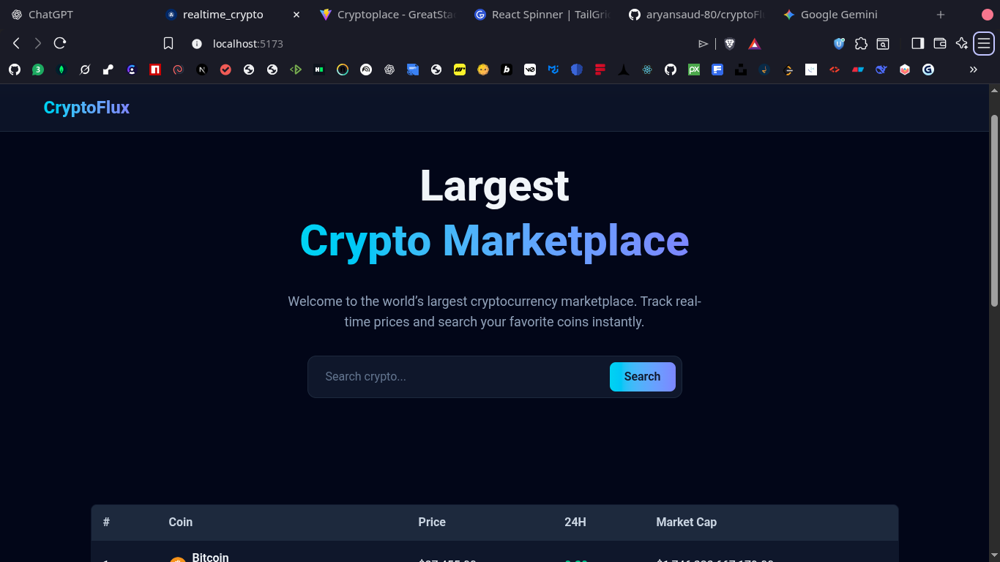
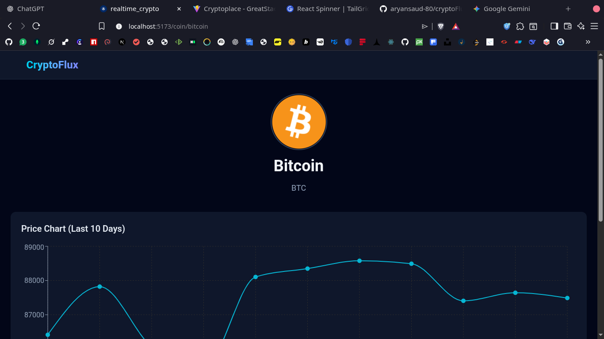

# 🚀 CryptoFlux

A modern, high-performance cryptocurrency dashboard built with **React 18**, **TypeScript**, and **Vite**. This application enables users to track the top 100 cryptocurrencies in real-time, visualize price trends via interactive charts, and access detailed market statistics.

---

## 🌟 Features

- **Real-time Tracking:** Explore the top 100 cryptocurrencies by market cap.
- **Instant Search:** Client-side filtering by coin name or ticker symbol.
- **Interactive Visuals:** 10-day price history visualized with **Recharts**.
- **Detailed Analytics:** Dedicated pages for each coin featuring market rank, 24h highs/lows, and market cap.
- **Responsive UI:** Optimized for desktop, tablet, and mobile using **Tailwind CSS**.
- **Context API:** Global state management for seamless data flow across the app.

---

## 🛠 Tech Stack

| Category          | Technology                 |
| :---------------- | :------------------------- |
| **Frontend**      | React 18, TypeScript, Vite |
| **Styling**       | Tailwind CSS               |
| **Routing**       | React Router DOM           |
| **Charts**        | Recharts                   |
| **Data Fetching** | Axios                      |
| **API**           | CoinGecko API              |

---

## 📁 Project Structure

```text
src/
├── api/            # API instance and service calls
├── components/     # Reusable UI components (Table, Hero, Loader, etc.)
├── context/        # CoinContext for global state
├── pages/          # Home and Coin Detail views
├── types/          # TypeScript interfaces and types
├── App.tsx         # Main routing and layout
└── main.tsx        # Entry point
```

🚀 Setup & Installation

### 1. Clone the repository

```bash
git clone https://github.com/aryansaud-80/cryptoFlux.git

cd cryptoFlux

```

### 2. Configure Environment Variables

#### Create a .env file in the root directory:

```bash

VITE_API_KEY=your_coingecko_demo_api_key
```

### 3. Install Dependencies

```Bash

npm install
```

### 4. Run Development Server

```Bash

npm run dev
```

The app will be available at: `http://localhost:5173`

# 🖼 ScreenshotsHome

### Home Page



### CoinDetail Page



# 📊 Data Limitations & Notes

- API Usage: This project uses the CoinGecko Public API. Please note that rate limits apply.

- Pagination: Intentionally omitted to prioritize performance for the top 100 coins.

- Search Scope: Searching is performed on the locally fetched dataset (Top 100) to ensure instant results.

# 🚧 Future Roadmap

- [ ] Implement Infinite Scroll/Pagination for the full market list.

- [ ] Add Multi-currency support (EUR, GBP, JPY).

- [ ] Create a "Favorites" watchlist using LocalStorage.

- [ ] Dark/Light mode toggle.

# 📄 License

This project is licensed under the MIT License.

# ⭐ Credits

- Data provided by CoinGecko

- Charts by Recharts

- Styling inspired by modern Fintech dashboards.
